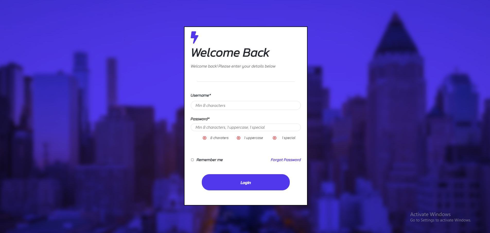

# City Login

## A simple login validation page

## Prominent features
* username and password login validations
* indicators for validation checks
* transitions to success page
* visually appealing UI

## Tech stack

    

## How to view this app

This app can be viewed locally or through city-login.com

To view locally

clone the project (prefferably on a text editor)
install all necessary packages
navigate to its main directory via terminal 'cd login-form'
run project with 'npm start'

## Packages used 
* None

## Known issues
* None